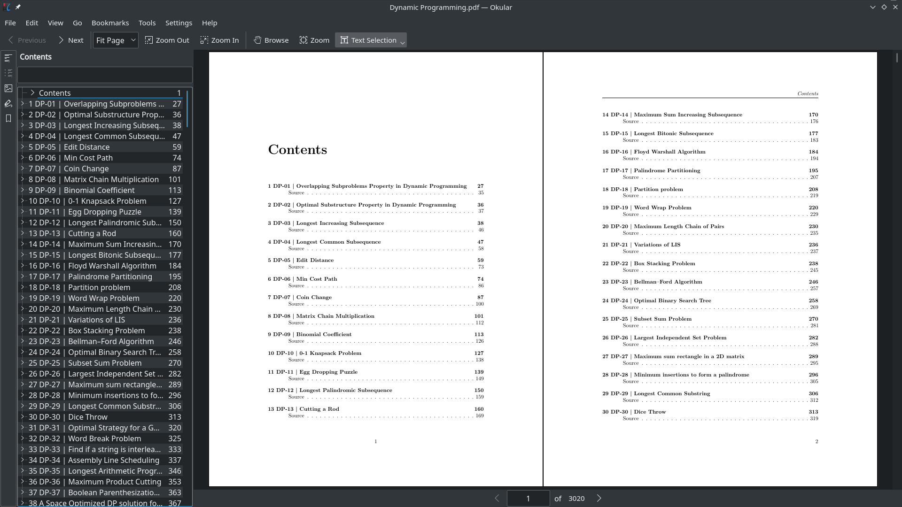

# Geeks for Geeks PDFs

Download the PDFs from the [releases page.](https://github.com/dufferzafar/geeks-pdf/releases/)

I started in 2015 from [@gnijuohz's repo](https://github.com/gnijuohz/geeksforgeeks-as-books/), but now (in 2018) I've re-written pretty much every part of the process. 

## Dependencies

* `docopt`
    - Basic CLI in scripts

* `requests` & `requests_cache`
    - To download pages and cache the result locally

* `lxml`
    - Cleaning of the downloaded pages

* [`pandoc`](http://pandoc.org/) & [`xelatex`](http://stefanocoretta.altervista.org/xelatex-linguistics/installation/)
    - Convert the cleaned pages to PDF

## Running the code

1. First, find out a "topic url" for what you want to download. Eg:

    * `https://www.geeksforgeeks.org/tag/samsung/`
    * `https://www.geeksforgeeks.org/category/dynamic-programming/`

2. Create a JSON containing links of all posts on that topic

    * `py3.6 list_links.py https://www.geeksforgeeks.org/tag/samsung/`

    * This JSON can now be edited by hand, to remove some links, re-order them etc.

3. Now fetch the actual posts

    * `py3.6 download_html.py JSON/Samsung.json`

4. Finally, convert the HTML to a PDF using Pandoc

    * `py3.6 html_to_pdf.py HTML/Samsung.html`

Things will work only if you're really lucky. This project has taught me how fragile my HTML to PDF pipeline really is. There's just too many things that can go wrong.

## What could go wrong

* The PDF engine that pandoc calls may err!
    - In which case, you should convert the html to tex
    - Then run pandoc on the tex file in verbose mode
    - and manually fix the tex file

## Topic URLs

List of Topic URLs that have I've fetched. You can [download these from the releases page](https://github.com/dufferzafar/geeks-pdf/releases/).

**Algorithms**

* https://www.geeksforgeeks.org/category/algorithm/greedy/
* https://www.geeksforgeeks.org/category/algorithm/bit-magic/
* https://www.geeksforgeeks.org/category/algorithm/divide-and-conquer/
* https://www.geeksforgeeks.org/category/algorithm/geometric/
* https://www.geeksforgeeks.org/category/algorithm/combinatorial/
* https://www.geeksforgeeks.org/category/algorithm/randomized/
* https://www.geeksforgeeks.org/category/algorithm/searching/
* https://www.geeksforgeeks.org/category/algorithm/sorting/
* https://www.geeksforgeeks.org/category/algorithm/recursion/
* https://www.geeksforgeeks.org/category/algorithm/analysis/
* https://www.geeksforgeeks.org/category/algorithm/game-theory/
* https://www.geeksforgeeks.org/category/algorithm/pattern-searching/
* https://www.geeksforgeeks.org/category/algorithm/branch-and-bound/

* https://www.geeksforgeeks.org/category/backtracking/
* https://www.geeksforgeeks.org/tag/dynamic-programming/

**Data Strucutres**

* https://www.geeksforgeeks.org/category/graph/
* https://www.geeksforgeeks.org/category/tree/
* https://www.geeksforgeeks.org/category/data-structures/hash/
* https://www.geeksforgeeks.org/category/data-structures/matrix/
* https://www.geeksforgeeks.org/category/data-structures/heap/
* https://www.geeksforgeeks.org/category/data-structures/stack/
* https://www.geeksforgeeks.org/category/data-structures/queue/
* https://www.geeksforgeeks.org/category/data-structures/linked-list/
* https://www.geeksforgeeks.org/category/data-structures/c-strings/

* https://www.geeksforgeeks.org/category/data-structures/c-arrays/
* https://www.geeksforgeeks.org/category/data-structures/binary-search-tree/

**Companies**

* https://www.geeksforgeeks.org/tag/microsoft/
* https://www.geeksforgeeks.org/tag/samsung/
* https://www.geeksforgeeks.org/tag/ibm/
* https://www.geeksforgeeks.org/tag/uber/
* https://www.geeksforgeeks.org/tag/appdynamics/
